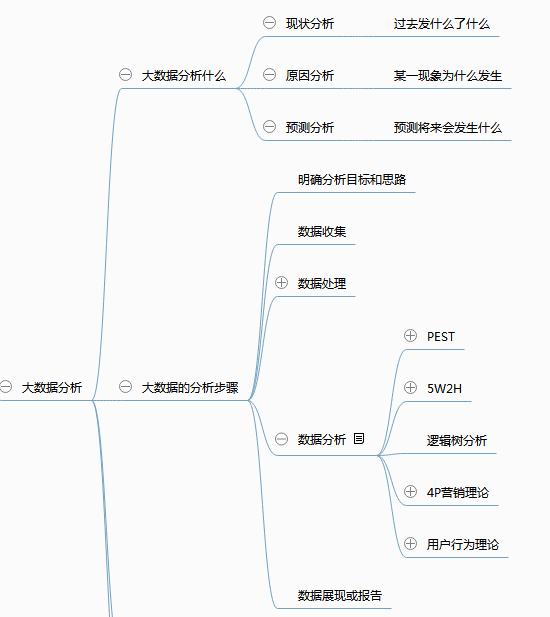

# 爬虫爬取的数据有什么用
* 和搜索引擎结合使用
* 进行数据分析 
	对数据进行分析，提取有价值的信息（偏好、位置）
	* 什么是数据分析？
	对已经存在的数据进行归类和总结，得到有价值的信息。

* 案例说明
	* Wifi 定位一个人 分析wifi周边的人流量
	* 获取你的网页浏览记录 分析偏好

### 总结
互联网我们的爬虫不仅仅是为搜索而存在的，大多数时候是为数据分析而存在的。
爬虫开发是大数据分析的一个基本条件。