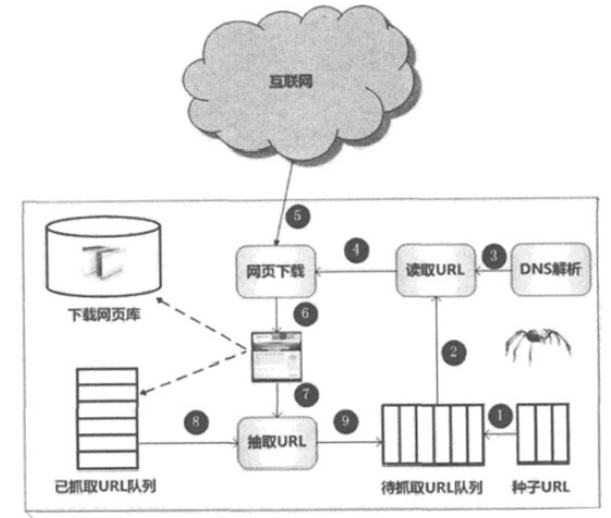
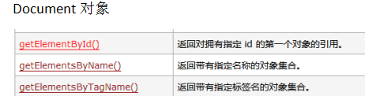

# 爬虫的运行原理

### 你自己如何获取网页上的数据？
* 1、打开一个网页 
* 2、复制 标题 新闻内容 下载图片

### 爬虫爬取一个页面的流程
* 3、指定一个URL
* 4、发起一个网络请求 HTTP
* 5、得到一个HTML文档
* 6、解析HTML文档

### 爬虫爬取多个页面
* 1、指定很多个URL
	数据结构 list
* 2、从list中依次拿取url
	* 发起一个网络请求 HTTP
	* 得到一个HTML文档
 	* 解析HTML文档
		* 顺便解析出其他URL
		* 将解析的URL存放到等待爬取的URL中

### 爬虫的原理图

步骤说明：
* 1、将一个种子URL存放到队里中
* 2、从队列中读取一个URL
* 3、发起网络请求(上图4-5-6步)
	* 3.1、域名解析，得到IP地址
	* 3.2、发起HTTP请求
	* 3.3、下载页面
* 4、解析HTML文档(上图7-8-9步)
	*　解析HMTL文档获取网页中所有URL
	* 分页页面是否爬取过
		* 如果没有爬取就放入待抓取的URL队里中

#分析网络爬虫开发技术
需求：爬取一个页面的内容
* 1、**人的操作**：找到URL  输入到浏览器的地址栏 回车
	浏览器帮我们发送了网络请求
	**技术实现：如何发送网络请求**
	* Socket（服务端、客户端）
	* HttpURLConnection（用来访问http连接）
	* HttpClient （操作网络请求更快的API） 学会HTTPClient
	
	三个技术点之间的关系： 
	* Socket原生底层（ip、port） 除非我们自己开发游戏服务器
	* HttpURLConnection JDK提供的一套访问Http资源的API
	* HttpClient 基于HttpURLConnection高度封装，不需要关注网络请求的细节。

* 2、**人的操作**：得到一个HTML文档二进制数据
	浏览器帮我们解析了二进制数据，将网页按照HTML的标准呈现给我们
	**技术实现：如何获取HTML页面**
	Inputstream 转化成 String 得到HTML纯文本数据。
	知道HTML文档格式，因为我们要进一步解析数据

* 3、**人的操作**：人为的复制、粘贴操作
	通过代码来解析HTML文档，获取有用的数据。
	**技术实现：如何解析数据**
	* Document对象 

	* JSOUP 为解析HTML而生。 

	技术点之间的关系：
	Document对象是原生的API，Jsoup是更高级的框架。

### 总结：爬虫开发的两个核心技术
	* Httpclient：帮助我们更好发送网络请求
	* Jsoup：帮助我们更好的解析html。