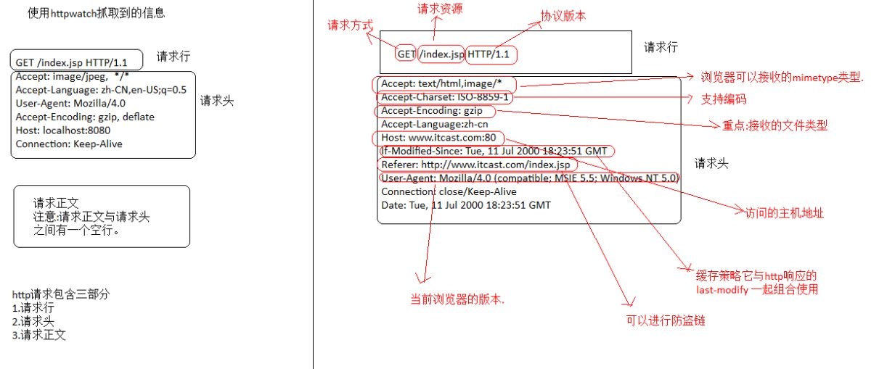
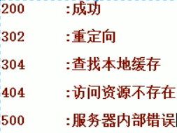

# 如何模拟浏览器进行网络请求

* 1、HTTP协议
* 2、Java网络请求原生API
	* 2.1、Java网络请求原生API-Get请求
	* 2.2、Java网络请求原生API-Post请求
* 3、使用HttpClient进行网络请求
	* 3.1、使用HttpClient进行Get请求
	* 3.2、使用HttpClient进行POST请求
	* 3.3、使用HttpClient进行Get请求-简单
	* 3.4、使用HttpClient进行POST请求-简单

# 1、HTTP协议
HTTP是一个客户端和服务器端请求和应答的标准（TCP）。客户端是终端用户，服务器端是网站。通过使用Web浏览器、网络爬虫或者其它的工具，客户端发起一个到服务器上指定端口（默认端口为80）的HTTP请求。


客户端向服务器发送一个请求，请求头包含请求的方法、URL、协议版本、以及包含请求修饰符、客户信息和内容的类似于MIME的消息结构。

服务器以一个状态行作为响应，响应的内容包括消息协议的版本，成功或者错误编码加上包含服务器信息、实体元信息以及可能的实体内容。

通常HTTP消息包括客户机向服务器的请求消息和服务器向客户机的响应消息。这两种类型的消息由一个起始行，一个或者多个头域，一个指示头域结束的空行和可选的消息体组成。



HTTP的头域包括通用头，请求头，响应头和实体头四个部分。每个头域由一个域名，冒号（:）和域值三部分组成。域名是大小写无关的，域值前可以添加任何数量的空格符，头域可以被扩展为多行，在每行开始处，使用至少一个空格或制表符。


HTTP常见状态码   [所有的状态码:百度百科](http://baike.baidu.com/link?url=zZnwNYkU6BOnCYJppHe3aw5f3lW2AgzxWGfSYmAqck5ytYmSN8FT_BxCslKYK7grv0wdWsXeezd1aIQM6HpKSa)




# 2、Java网络请求原生API

HttpUrlConnection 

Get 方式请求网络基本流程
* 给定一个域名：www.itcast.cn
* 创建URL对象
* 通过URL对象打开一个连接
* 判断请求状态是否等于200
	* 输入流：获取服务端的响应数据
	* 使用BufferReader读取数据
	* 关闭流

Post 方式请求网络基本流程
* 给定一个域名：www.itcast.cn
* 创建URL对象
* 通过URL对象打开一个连接
* 设定Post请求方式
	* 指定 requestMethod为post
	* 打开 conn.setDoOutput(true)
* 提交数据到服务器
	* 获取outputStream
	* 写出数据
	* flush and close
* 判断请求状态是否等于200
	* 输入流：获取服务端的响应数据
	* 使用BufferReader读取数据
	* 关闭流

### 2.1、Java网络请求原生API-Get请求
使用原生API发送Get请求
```java
public class Get {
    public static final String USER_AGENT = "Mozilla/5.0";
    public static void main(String[] args) throws IOException {
        //1、准备要访问的URL
        String url = "http://www.itcast.cn";
        URL obj = new URL(url);
        HttpURLConnection con = (HttpURLConnection) obj.openConnection();

        //2、设置Http协议的参数
        // optional default is GET
        con.setRequestMethod("GET");
        //add request header
        con.setRequestProperty("User-Agent", USER_AGENT);

        //3、发起HTTP请求，获取状态码
        int responseCode = con.getResponseCode();
        System.out.println("\nSending 'GET' request to URL : " + url);
        System.out.println("Response Code : " + responseCode);

        //4、如果是正常相应，读取数据
        if (responseCode == 200) {
            BufferedReader in = new BufferedReader(
                    new InputStreamReader(con.getInputStream()));
            String inputLine;
            StringBuffer response = new StringBuffer();
            while ((inputLine = in.readLine()) != null) {
                response.append(inputLine);
            }
            in.close();
            //print result
            System.out.println(response.toString());
        }
    }
}
```

### 2.2、Java网络请求原生API-Post请求
使用原生API发送Post请求
```java
package cn.itcast.pcss.base.httpurlconnection;

import java.io.BufferedReader;
import java.io.DataOutputStream;
import java.io.IOException;
import java.io.InputStreamReader;
import java.net.HttpURLConnection;
import java.net.URL;

public class Post {
    public static final String USER_AGENT = "Mozilla/5.0";
    public static void main(String[] args) throws IOException {
        String url = "http://sspc.itcast.cn/login/login.html";
        URL obj = new URL(url);
        HttpURLConnection con = (HttpURLConnection) obj.openConnection();

        //add reuqest header
        con.setRequestMethod("POST");
        con.setRequestProperty("User-Agent", Post.USER_AGENT);
        con.setRequestProperty("Accept-Language", "en-US,en;q=0.5");

        String urlParameters = "username=maoxiangyi&password=&maoxiangyi&reURL=http://shop.itcast.cn/item/itemList.html";

        // Send post request
        con.setDoOutput(true);
        DataOutputStream wr = new DataOutputStream(con.getOutputStream());
        wr.writeBytes(urlParameters);
        wr.flush();
        wr.close();

        int responseCode = con.getResponseCode();
        System.out.println("\nSending 'POST' request to URL : " + url);
        System.out.println("Post parameters : " + urlParameters);
        System.out.println("Response Code : " + responseCode);
        if (responseCode == 200) {
            BufferedReader in = new BufferedReader(new InputStreamReader(con.getInputStream()));
            String inputLine;
            StringBuffer response = new StringBuffer();
            while ((inputLine = in.readLine()) != null) {
                response.append(inputLine);
            }
            in.close();
            System.out.println(response.toString());
        }
    }
}
```

# 3、使用HttpClient进行网络请求
本节介绍使用HttpClient进行网络请求。

HttpClient 是 Apache Jakarta Common 下的子项目，可以用来提供高效的、最新的、功能丰富的支持 HTTP 协议的客户端编程工具包，并且它支持 HTTP 协议最新的版本和建议。

[HtppClient 官网](http://hc.apache.org/)

为什么有HttpClient
* 超文本传输协议（HTTP）可能是当今互联网上使用的最重要的协议
* 虽然java.net包提供了通过HTTP访问资源的基本功能，但它并没有提供许多应用程序所需的完全灵活性或功能

使用HttpClient的maven依赖
```java
<dependency>
    <groupId>org.apache.httpcomponents</groupId>
    <artifactId>httpclient</artifactId>
    <version>4.5.3</version>
</dependency>
<dependency>
	<groupId>org.apache.httpcomponents</groupId>
	<artifactId>fluent-hc</artifactId>
	<version>4.5.2</version>
</dependency
```
### 3.1、使用HttpClient进行Get请求
使用HttpClient进行Get请求

* HttpClients.createDefault 创建一个客户端
* HttpGet 创建一个Get请求
* httpclient.execute(httpGet) 执行一个请求
* CloseableHttpResponse 获取返回值
	* getStatusLine 获取状态信息 
	* EntityUtils 操作返回内容

代码实现

```java
import org.apache.http.HttpEntity;
import org.apache.http.client.methods.CloseableHttpResponse;
import org.apache.http.client.methods.HttpGet;
import org.apache.http.impl.client.CloseableHttpClient;
import org.apache.http.impl.client.HttpClients;
import org.apache.http.util.EntityUtils;

import java.nio.charset.Charset;

/**
 * Created by maoxiangyi on 2017/6/26.
 */
public class SimpleGet {
    public static void main(String[] args) throws Exception {
        CloseableHttpClient httpclient = HttpClients.createDefault();
        HttpGet httpGet = new HttpGet("http://sspc.itcast.cn");
        CloseableHttpResponse response = httpclient.execute(httpGet);
        System.out.println(response.getStatusLine());
        if (response.getStatusLine().getStatusCode() == 200) {
            HttpEntity entity = response.getEntity();
            String html = EntityUtils.toString(entity, Charset.forName("utf-8"));
            System.out.println(html);
        }
        response.close();
    }
}
```

### 3.2、使用HttpClient进行Post请求

使用HttpClient进行Post请求

* HttpClients.createDefault 创建一个客户端
* HttpPost 创建一个Post请求
	* UrlEncodedFormEntity 封装表单信息
* httpclient.execute(HttpPost) 执行一个请求
* CloseableHttpResponse 获取返回值
	* getStatusLine 获取状态信息 
	* EntityUtils 操作返回内容

代码实现：


```java
import org.apache.http.Header;
import org.apache.http.HttpEntity;
import org.apache.http.NameValuePair;
import org.apache.http.client.entity.UrlEncodedFormEntity;
import org.apache.http.client.methods.CloseableHttpResponse;
import org.apache.http.client.methods.HttpGet;
import org.apache.http.client.methods.HttpPost;
import org.apache.http.impl.client.CloseableHttpClient;
import org.apache.http.impl.client.HttpClients;
import org.apache.http.message.BasicNameValuePair;
import org.apache.http.util.EntityUtils;

import java.nio.charset.Charset;
import java.util.ArrayList;
import java.util.List;

/**
 * Created by maoxiangyi on 2017/6/26.
 */
public class SimplePost {
    public static void main(String[] args) throws Exception {
        CloseableHttpClient httpclient = HttpClients.createDefault();
        HttpPost httpPost = new HttpPost("http://shop.itcast.cn/login/login.html");
        List<NameValuePair> nvps = new ArrayList<NameValuePair>();
        nvps.add(new BasicNameValuePair("username", "maoxiangyi"));
        nvps.add(new BasicNameValuePair("password", "maoxiangyi"));
        nvps.add(new BasicNameValuePair("reURL", "http://shop.itcast.cn/item/itemList.html"));
        httpPost.setEntity(new UrlEncodedFormEntity(nvps));
        CloseableHttpResponse response = httpclient.execute(httpPost);
        System.out.println(response.getStatusLine());
        //如果登录之后需要重定向，获取重定向的值
        Header[] headers = response.getAllHeaders();
        for (Header header : headers) {
            System.out.println(header);
        }
        if (response.getStatusLine().getStatusCode() == 302) {
            Header[] locations = response.getHeaders("Location");
            String url = locations[0].getValue();
            System.out.println(url);
            HttpGet httpGet = new HttpGet(url);
            CloseableHttpResponse response1 = httpclient.execute(httpGet);
            if (response1.getStatusLine().getStatusCode() == 200) {
                HttpEntity entity = response1.getEntity();
                String html = EntityUtils.toString(entity, Charset.forName("utf-8"));
                System.out.println(html);
            }
            response1.close();
        }
        response.close();
    }
}
```

### 3.3、使用HttpClient进行Get请求-简单方式
使用HttpClient进行Get请求-简单方式

```java
import org.apache.http.HttpEntity;
import org.apache.http.HttpHost;
import org.apache.http.HttpVersion;
import org.apache.http.client.fluent.Form;
import org.apache.http.client.fluent.Request;
import org.apache.http.entity.ContentType;

import java.io.IOException;
import java.nio.charset.Charset;

/**
 * Created by maoxiangyi on 2017/6/26.
 */
public class EasyGet {
    public static void main(String[] args) throws IOException {
        String html = Request.Get("http://shop.itcast.cn").execute().returnContent().asString(Charset.forName("UTF-8"));
        System.out.println(html);
    }
}
```
### 3.4、使用HttpClient进行Post请求-简单

使用HttpClient进行Post请求-简单方式

```java
import org.apache.http.Header;
import org.apache.http.HttpEntity;
import org.apache.http.HttpResponse;
import org.apache.http.client.fluent.Form;
import org.apache.http.client.fluent.Request;
import org.apache.http.client.methods.CloseableHttpResponse;
import org.apache.http.client.methods.HttpGet;
import org.apache.http.util.EntityUtils;

import java.io.IOException;
import java.nio.charset.Charset;

/**
 * Created by maoxiangyi on 2017/6/26.
 */
public class EasyPost {
    public static void main(String[] args) throws IOException {
        HttpResponse response = Request.Post("http://shop.itcast.cn/login/login.html")
                .bodyForm(Form.form().add("username", "maoxiangyi").add("password", "maoxiangyi").add("reURL","http://shop.itcast.cn/item/itemList.html").build())
                .execute().returnResponse();
        if (response.getStatusLine().getStatusCode() == 302) {
            Header[] locations = response.getHeaders("Location");
            String url = locations[0].getValue();
            System.out.println(url);
            HttpGet httpGet = new HttpGet(url);
            String html =  Request.Get(url).execute().returnContent().asString(Charset.forName("UTF-8"));
            System.out.println(html);
        }
    }
}
```