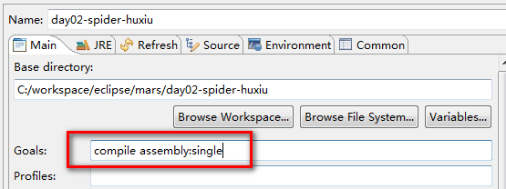
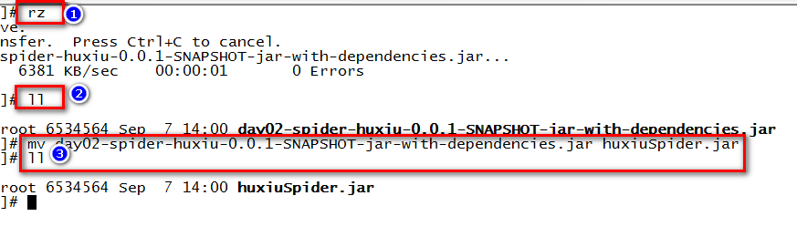
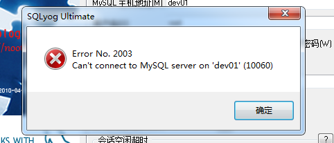
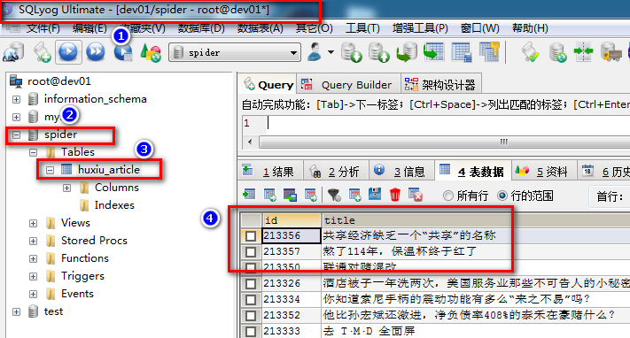

# 爬虫高级课程

* 1、某新闻网站部署
	* 1.1、部署环境准备
	* 1.2、配置项目运行环境
		* 1.2.1、项目需要的环境分析
		* 1.2.2、安装环境
	* 1.3、部署项目
		*  1.3.1、在mysql上创建数据库
		*  1.3.2、将项目打包
		*  1.3.3、运行项目
	* 1.4 在window上远程访问mysql
* 2、单机爬虫如何演变成分布式爬虫
	* 单机爬虫的问题
	* 分布式爬虫的一般架构
		* 单机爬虫架构
		* 分布式爬虫架构
	* 分布式爬虫开发技术分析
* 3、开发某电商分布式爬虫
	* 

# 1、某新闻网站部署

# 1.1、部署环境准备
* 需要一台服务器
	* 在企业中是真实的硬件
	* 在学习中是虚拟机
* 在服务器上安装linux操作系统
	* 互联网企业基本上都是使用linux系统
	* 一般都会安装CentOS的版本，6.5以上。

# 1.2、配置项目运行环境
#### 1.2.1、环境基本情况
* Java项目都需要安装JDK
* 爬虫项目需要连接外网，需要linux服务器能够联网
* 爬虫爬取的数据需要保存到数据，需要安装数据库

#### 1.2.2、安装环境
* 安装JDK，省略
* 配置Linux的网络
	* 三种网络方式
* 安装数据库
安装命令：
```shell
yum install -y mysql-server
```
启动命令：
```shell
service mysqld start
```

# 1.3 部署项目
#### 1.3.1、在mysql上创建数据库
* 数据库建表语句
```shell
DROP TABLE IF EXISTS `huxiu_article`;
CREATE TABLE `huxiu_article` (
  `id` varchar(250) DEFAULT NULL,
  `title` varchar(250) DEFAULT NULL,
  `author` varchar(250) DEFAULT NULL,
  `createTime` varchar(250) DEFAULT NULL,
  `zan` varchar(250) DEFAULT NULL,
  `pl` varchar(250) DEFAULT NULL,
  `sc` varchar(250) DEFAULT NULL,
  `content` blob,
  `url` varchar(250) DEFAULT NULL
) ENGINE=InnoDB DEFAULT CHARSET=utf8;
```
* 操作记录	


#### 1.3.2、将项目打包
* 修改数据库链接信息
```shell
public class ArticleDao extends JdbcTemplate {

	public ArticleDao() {
		// 创建C3P0的datasource 1.配置 2.代码
		ComboPooledDataSource dataSource = new ComboPooledDataSource();
		// 1.url
		dataSource.setJdbcUrl("jdbc:mysql://localhost:3306/spider?characterEncoding=utf-8");
		// 2.driver 不需要
		// 3.username&password
		dataSource.setUser("root");
		dataSource.setPassword("root");
		setDataSource(dataSource);
	}
}
```
* eclipse默认打包方式没有依赖的jar
* 使用maven的assembly plugin插件
```shell
<build>
		<plugins>
			<plugin>
				<artifactId>maven-assembly-plugin</artifactId>
				<configuration>
					<archive>
						<manifest>
							<mainClass>huxiuSpider.HuxiuSpider</mainClass>
						</manifest>
					</archive>
					<descriptorRefs>
						<descriptorRef>jar-with-dependencies</descriptorRef>
					</descriptorRefs>
				</configuration>
			</plugin>
		</plugins>
	</build>
```
	* compile assembly:single
	* 操作示意

	* 查看打好的包


#### 1.3.3、运行项目

基本命令

* 将项目上传到Linux服务器上
	* 使用rz命令上传

* 运行 java 包
	* java -jar xxx.jar

	* 解决错误 Access denied for user 'root'@'localhost' (using password: YES)
```shell
java.sql.SQLException: Access denied for user 'root'@'localhost' (using password: YES)
        at com.mysql.jdbc.SQLError.createSQLException(SQLError.java:964)
        at com.mysql.jdbc.MysqlIO.checkErrorPacket(MysqlIO.java:3973)
        at com.mysql.jdbc.MysqlIO.checkErrorPacket(MysqlIO.java:3909)
        at com.mysql.jdbc.MysqlIO.checkErrorPacket(MysqlIO.java:873)
        at com.mysql.jdbc.MysqlIO.secureAuth411(MysqlIO.java:4420)
        at com.mysql.jdbc.MysqlIO.doHandshake(MysqlIO.java:1278)
        at com.mysql.jdbc.ConnectionImpl.coreConnect(ConnectionImpl.java:2205)
        at com.mysql.jdbc.ConnectionImpl.connectOneTryOnly(ConnectionImpl.java:2236)
        at com.mysql.jdbc.ConnectionImpl.createNewIO(ConnectionImpl.java:2035)
        at com.mysql.jdbc.ConnectionImpl.<init>(ConnectionImpl.java:790)
        at com.mysql.jdbc.JDBC4Connection.<init>(JDBC4Connection.java:47)
        at sun.reflect.GeneratedConstructorAccessor29.newInstance(Unknown Source)
        at sun.reflect.DelegatingConstructorAccessorImpl.newInstance(DelegatingConstructorAccessorImpl.java:45)
        at java.lang.reflect.Constructor.newInstance(Constructor.java:423)
        at com.mysql.jdbc.Util.handleNewInstance(Util.java:425)
        at com.mysql.jdbc.ConnectionImpl.getInstance(ConnectionImpl.java:400)
        at com.mysql.jdbc.NonRegisteringDriver.connect(NonRegisteringDriver.java:330)
        at com.mchange.v2.c3p0.DriverManagerDataSource.getConnection(DriverManagerDataSource.java:134)
        at com.mchange.v2.c3p0.WrapperConnectionPoolDataSource.getPooledConnection(WrapperConnectionPoolDataSource.java:182)
        at com.mchange.v2.c3p0.WrapperConnectionPoolDataSource.getPooledConnection(WrapperConnectionPoolDataSource.java:171)
        at com.mchange.v2.c3p0.impl.C3P0PooledConnectionPool$1PooledConnectionResourcePoolManager.acquireResource(C3P0PooledConnectionPool.java:137)
        at com.mchange.v2.resourcepool.BasicResourcePool.doAcquire(BasicResourcePool.java:1014)
        at com.mchange.v2.resourcepool.BasicResourcePool.access$800(BasicResourcePool.java:32)
        at com.mchange.v2.resourcepool.BasicResourcePool$AcquireTask.run(BasicResourcePool.java:1810)
        at com.mchange.v2.async.ThreadPoolAsynchronousRunner$PoolThread.run(ThreadPoolAsynchronousRunner.java:547)
```
解决错误的方法：
```shell
use mysql;
UPDATE user SET Password = PASSWORD('root') WHERE user = 'root';
flush privileges; 
-
use mysql;
select Host,user,password from user;
-
grant all privileges on *.* to root@"localhost" identified by "root" with grant option;
flush privileges; 
```
* 运行效果
 
* 解决错误 mysql客户端乱码
```shell
show variables like '%char%';
```
vi /etc/my.cnf
```shell
[mysql]
default-character-set=utf8
```


# 1.4 在window上远程访问mysql
* 不能连接
	
**解决办法，关闭防火墙**
```shell
service iptables stop
```
* 不被允许连接

**解决方法，在mysql.user表中开放权限**
```shell
grant all privileges on *.* to root@"192.168.239.2" identified by "root" with grant option;
flush privileges; 
```


#1.5、将项目部署到服务器的几个常见问题
* 数据库问题
	* 创建数据库
	* 修改密码，使项目中的密码与之相同
	* 开放数据库连接
	* mysql客户端的显示乱码问题
* 系统层面
	* 防火墙的问题
		* 直接关闭防火墙
		* 或者请运维单独配置

# 2、单机版本的爬虫如何演变成分布式爬虫
# 2.1 单机爬虫的问题
* 单机爬虫运行在一台服务器的一个JVM上。
	* 服务器有停电的风险
	* 服务器有磁盘坏掉的风险
	* 服务器的网卡一般都是千兆网卡，数据量太大会有风险
		* 千兆网络是全双工的,也就是上下行是并行工作的,也就是说上行下行同时能达到理论值125MB/s
	* JVM本质上是个进程，虽说很稳定，但也有挂掉的风险
* 面对有防御策略的网站，单机爬虫战斗力不足
	* 参见[《爬虫攻防技术分析》](2-爬虫攻防技术分析.html)

# 2.2、分布式爬虫的一般架构
#### 2.2.1 单机爬虫的架构


#### 2.2.2 分布式爬虫的架构


# 2.3、分布式爬虫开发技术分析
* 需要开发一个master
* 需要开发一个slave程序，并启动多个
* 需要一个公共的阻塞式队列（Redis List）
* 需要一个公共的去重的容器（Redis Set）

# 3、开发某电商分布式爬虫
# 3.1、需求说明
* 爬取京东网站手机信息
* 将爬取的数据保存到数据库

# 3.2、需求分析
* 入口分析
	* 类目
	* 搜索
* 请求参数分析
	* 首页分析
	* 分页分析

# 3.3、功能分析
* 首页功能分析
* 分页功能分析

# 3.4、代码开发
见代码
# 3.5、项目部署-学生动手实践


