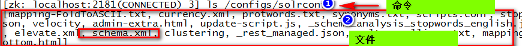
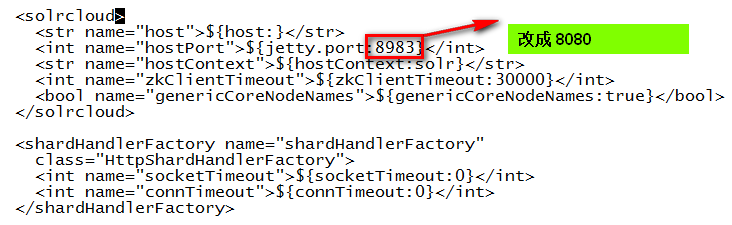
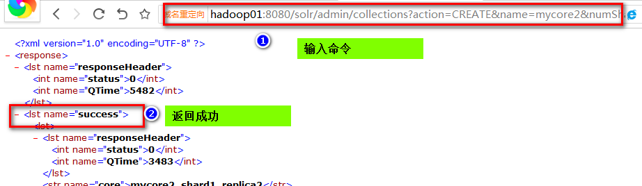

# Solr cloud部署实践

第一部分：初始化环境
* 1、初始化环境 
* 2、准备solr安装包
* 3、解压安装包
* 4、创建solr的工作目录
* 5、tomcat 软连接创建
* 6、没有6

第二部分：在Linux上部署单机版本的solr

* 7、将solr.war包拷贝到tomcat的webapps下
* 8、启动下tomcat，让tomcat帮解压solr.war，然后关闭tomcat
* 9、修改solr web项目的配置文件，指定solrhome
* 10、拷贝一个solr core到solr_home下
* 11、为solr的运行准备配置lib
* 12、修改collection1 的solrconfig.xml文件，配置lib路径
* 13、将ext扩展的jar包拷贝到solr的web项目下
* 14、启动solr
* 15、访问单机版本的solr服务

第三部分：配置集群
* 16、梳理修改了哪些目录
* 17、在其他机器上创建工作目录
* 18、拷贝安装内容到其它机器
* 19、启动zookeeper集群
* 20、将solr的配置文件上传到zookeeper
* 21、检查配置文件是否上传到zookeeper上
* 22、修改集群中每个solr的solr.xml文件
* 23、让solr和zookeeper产生关系
* 24、依次启动tomcat,配置完成

第四部分：配置新的集群
* 25、配置命令
* 26、命令说明
* 27、配置效果


# 第一部分：初始化环境
********
#### 1、初始化环境 
* 准备三台linux服务器
	* 创建虚拟机三台虚拟机器，并修改主机名称
		* 修改主机名称有两种方式
			* 固定：vi /etc/sysconf/network
			* 临时：hostanme 主机名称
	* 配置hosts内容
		* vi /etc/hosts
```shell
192.168.239.128 node1
192.168.239.129 node2
192.168.239.130 node3
```


* 在服务器上创建三个目录
	* software目录:software目录是用来存放软件安装包
```shell
mkdir -p /export/software
```
	* servers目录：servers目录用来用来安装软件
```shell
mkdir -p /export/servers
```
	* data目录：data目录用来存放软件运行的数据、日志
```shell
mkdir -p /export/data
```
* 关闭三台机器的防火墙
	* 永久关闭，需要重启
```shell
chkconfig iptables off
```
	* 临时管理，重启失效
```shell
service iptables stop
```
	* 关闭之后可查看防火墙状态
```shell
service iptables status
```	

#### 2、准备solr安装包
* 上传solr-4.10.2的安装包 到 /export/software 目录
* 上传 tomcat-

#### 3、解压安装包
* 解压solr
```shell
tar -zxvf solr-4.10.2.tgz -C /export/servers/
```
* 解压 tomcat
```shell
tar -zxvf apache-tomcat-7.0.57.tar.gz -C /export/servers/
```

#### 4、创建solr的工作目录
```shell
mkdir -p /export/data/solr_home
```

#### 5、tomcat 软连接创建
```shell
ln -s apache-tomcat-7.0.57/ tomcat4solr
```

#### 6、没有6

# 第二部分：在Linux上部署单机版本的solr
********
#### 7、将solr.war包拷贝到tomcat的webapps下
```shell
cd /export/servers/solr-4.10.2/example/webapps
cp solr.war /export/servers/tomcat4solr/webapps/
```
#### 8、启动下tomcat，让tomcat帮解压solr.war，然后关闭tomcat
```shell
cd /export/servers/tomcat4solr/bin/
./startup.sh 
./shutdown.sh 
```

#### 9、修改solr web项目的配置文件，指定solrhome
```shell
cd /export/servers/tomcat4solr/webapps/solr/WEB-INF/
vi web.xml
```
修改内容,并保存。


* 第一步 去掉注释
* 第二步 修改 env-entry-type 为 /export/data/solr_home

#### 9.1、拷贝扩展包到solr项目中
```shell
 cp /export/servers/solr-4.10.2/example/lib/ext/* /export/servers/apache-tomcat-7.0.57/webapps/solr/WEB-INF/lib/
```
#### 10、拷贝一个solr core到solr_home下
```shell
cd /export/servers/solr-4.10.2/example/solr
cp -r collection1/ /export/data/solr_home/
```

#### 11、为solr的运行准备配置lib
* 先创建lib目录
```shell
cd /export/data/solr_home/
mkdir lib
```
* 然后将依赖拷贝过来
```
cd lib/
cp -r /export/servers/solr-4.10.2/contrib/ .
cp -r /export/servers/solr-4.10.2/dist/ .
```

#### 12、修改collection1 的solrconfig.xml文件，配置lib路径
```shell
cd /export/data/solr_home/collection1/conf
vi solrconfig.xml
```
* 原始内容

* 修改后的内容


#### 13、将ext扩展的jar包拷贝到solr的web项目下
```shell
cd /export/servers/tomcat4solr/webapps/solr/WEB-INF/lib/
cp -r /export/servers/solr-4.10.2/example/lib/ext/* .
```
#### 14、启动solr
启动solr即使启动tomcat
```shell
cd /export/servers/tomcat4solr/bin
./startup.sh 
```

#### 15、访问单机版本的solr服务
```shell
http://{u solr hostname}:8080/solr
```

# 第三部分:配置集群
#### 16、梳理修改了哪些目录
* 三个标准目录
	* /export/data/    
	* /export/servers/
	* /export/software/
* 安装目录
	* /export/data/solr_home
	* /export/servers/tomcat4solr

总结，需要将两个solr的安装目录拷贝到其他机器上。

#### 17、在其他机器上创建工作目录
在hadoop02上操作
```shell
mkdir -p /export/data/solr_home
mkdir -p /export/servers/tomcat4solr
```
在hadoop03上操作
```shell
mkdir -p /export/data/solr_home
mkdir -p /export/servers/tomcat4solr
```

#### 18、拷贝安装内容到其它机器
在hadoop01上执行
```
scp -r /export/data/solr_home/* hadoop02:/export/data/solr_home/
scp -r /export/servers/tomcat4solr/* hadoop02:/export/servers/tomcat4solr/

scp -r /export/data/solr_home/* hadoop03:/export/data/solr_home/
scp -r /export/servers/tomcat4solr/* hadoop03:/export/servers/tomcat4solr/
```
问题，如果scp命令出错，就安装一个软件。
```shell
yum install openssh-clients -y
```

#### 19、启动zookeeper集群

#### 20、将solr的配置文件上传到zookeeper
主要是solrconfig.xml和scheme.xml、
```shell
cd /export/servers/solr-4.10.2/example/scripts/cloud-scripts

./zkcli.sh -zkhost zk01:2181,zk02:2181,zk03:2181 -cmd upconfig -confdir /export/data/solr_home/collection1/conf/ -confname solrconf
```
如果出现unzip的错误，直接安装unzip的包
```shell
yum install -y unzip
```
#### 21、检查配置文件是否上传到zookeeper上
使用zookeeper的客户端命令查看zookeeper的目录树
```shell
zkCli.sh 
```


#### 22、修改集群中每个solr的solr.xml文件
* 修改配置文件
```shell
cp /export/servers/solr-4.10.2/example/solr/solr.xml /export/data/solr_home/
cd /export/data/solr_home/
vi 
```


* 发送给其他节点
```shell
scp solr.xml hadoop02:$PWD
scp solr.xml hadoop03:$PWD
```

#### 23、让solr和zookeeper产生关系
修改每一台solr的tomcat 的 bin目录下catalina.sh文件中加入DzkHost指定zookeeper服务器地址。
```shell
cd /export/servers/tomcat4solr/bin
vi catalina.sh

export JAVA_OPTS="-DzkHost=zk01:2181,zk02:2181,zk03:2181"
```


然后分发到到其它机器上
```shell
scp catalina.sh hadoop02:$PWD
scp catalina.sh hadoop03:$PWD
```
#### 24、依次启动tomcat
在hadoop01上
```shell
cd /export/servers/tomcat4solr/bin
./startup.sh 
```
在hadoop02上
```shell
cd /export/servers/tomcat4solr/bin
./startup.sh
```
在hadoop03上
```shell
cd /export/servers/tomcat4solr/bin
./startup.sh
```
然后访问任意一台solr服务，可以看到集群配置成功。


# 第四部分：配置新的集群
********
# 25、配置命令
```shell
http://hadoop01:8080/solr/admin/collections?action=CREATE&name=mycore2&numShards=2&replicationFactor=2&maxShardsPerNode=8&property.schema=schema.xml&property.config=solrconfig.xml
```
# 26、命令说明
```shell
name指明collection名称
numShards指明分片数
replicationFactor指明副本数
maxShardsPerNode 每个节点最大分片数（默认为1）
property.schema：指定使用的schema.xml，这个文件必须在zookeeper上。
property.config：指定使用的solrconfig.xml，这个文件必须在zookeeper上。
```
# 27、执行效果



查看cloud管理界面：


